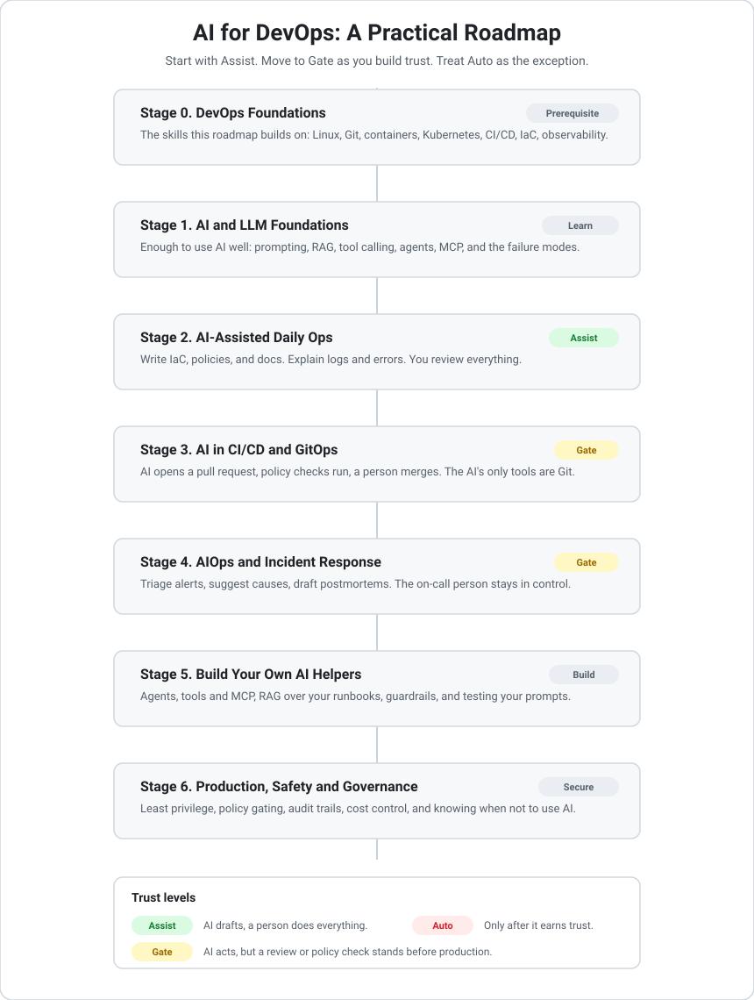

# AI for DevOps: A Practical Roadmap

A hands-on guide to using AI in real DevOps and platform work, without losing control of your systems.

Most guides show you flashy AI demos. This one answers the question you actually care about at work: where can AI help, and how do you keep it safe near production? The short version is simple. Let AI do the reading, drafting, and explaining. Keep humans and policy in charge of the doing.

This is written from day-to-day platform engineering: Kubernetes, GitOps, policy as code, and observability. It is meant to be useful whether you are just starting with AI or already building tools with it.

  

## New here? Start with these

- [Getting started](docs/getting-started.md): a short first-step path, even if you have never used AI at work.
- [Prompt library](prompts/README.md): ready-to-use prompts you can try on real work today.
- [Using AI to watch your systems](topics/03-monitoring/README.md): a deep dive on metrics, logs, and traces.

## Browse by topic

Each topic is its own folder with a focused guide. Full index in [topics](topics/README.md).

| Topic | What it covers | Trust level |
|-------|----------------|-------------|
| [1. AI foundations](topics/01-ai-foundations/README.md) | Enough about AI and LLMs to use them well and know their limits | Learn |
| [2. Everyday ops](topics/02-everyday-ops/README.md) | Write IaC and policies, explain errors, draft docs | Assist |
| [3. Monitoring](topics/03-monitoring/README.md) | Use AI for metrics, logs, and traces | Assist to Gate |
| [4. Alerts and incidents](topics/04-alerts-and-incidents/README.md) | Triage alerts, help the on-call, draft postmortems | Gate |
| [5. CI/CD and GitOps](topics/05-cicd-and-gitops/README.md) | AI in pull requests, tests, and GitOps changes | Gate |
| [6. Build your own helpers](topics/06-build-your-own/README.md) | Agents, tools, RAG, guardrails, and LLMOps | Build |
| [7. Production safety](topics/07-production-safety/README.md) | Least privilege, policy gating, audit, and cost | Secure |

## Who this is for

- DevOps, platform, and SRE engineers who want to use AI in their daily work.
- Team leads deciding where AI fits and where it does not belong.
- Engineers from an AI background who want to understand how ops teams actually run things.

## The one idea to remember

AI proposes. People and policy decide.

The quickest way to lose trust in AI at work is to let it change production without review. So we group every use of AI into three levels of trust:

| Level | What it means | Example |
|-------|---------------|---------|
| Assist | AI drafts, a person does everything | "Write me a Kyverno policy for this issue" |
| Gate | AI acts, but a review or policy check stands between it and production | AI opens a pull request that must pass checks and be merged by a person |
| Auto | AI acts on its own, only after it has proven itself on a narrow, well-tested task | Automatic rollback on a signal you fully trust |

Start at Assist. Move to Gate as you build confidence. Treat Auto as the rare exception that has to earn its place.

## What is in this repo

- [topics](topics/README.md): the seven topic guides, one folder each, from foundations to production safety.
- [prompts](prompts/README.md): a library of ready-to-use prompts for common DevOps tasks.
- [examples](examples/README.md): small, safe examples you can learn from and adapt.
- [tools](tools/README.md): a curated catalog of AI-for-DevOps tools, each with a trust level.
- [resources](resources/README.md): further reading, hand-picked articles, papers, and docs.
- [glossary](glossary/README.md): plain-language definitions of the AI terms in this roadmap.
- [docs/getting-started.md](docs/getting-started.md): the first steps and the two habits that keep you safe.

## The roadmap

1. [Everyday help](#1-everyday-help)
2. [Watching your systems: metrics, logs, and traces](#2-watching-your-systems-metrics-logs-and-traces)
3. [Alerts and incidents](#3-alerts-and-incidents)
4. [AI in CI/CD and GitOps](#4-ai-in-cicd-and-gitops)
5. [Building your own AI helpers](#5-building-your-own-ai-helpers)
6. [Keeping it safe in production](#6-keeping-it-safe-in-production)
7. [Tools worth knowing](#7-tools-worth-knowing)
8. [Things to avoid](#8-things-to-avoid)

## 1. Everyday help

This is where almost everyone should start. It is low risk because you review everything before it runs. Trust level: Assist.

- Write and clean up Terraform, Helm charts, Kustomize, and Kubernetes manifests.
- Turn a requirement or a security finding into a draft policy (Kyverno, OPA, conftest). See the [policy prompt](prompts/write-a-kyverno-policy.md).
- Explain a confusing log line, stack trace, or error message in plain language.
- Write and improve runbooks and internal docs.
- Summarize a pull request or draft a clear commit message. See the [PR review prompt](prompts/review-a-pull-request.md).
- Answer read-only questions in Slack, like "which services are on version 1.4".

One rule: never paste secrets, tokens, or customer data into a hosted model. Redact first, or use a model that runs locally.

## 2. Watching your systems: metrics, logs, and traces

This is where AI saves the most time day to day. You are drowning in signals, and AI is good at reading a lot of text fast and explaining it in words. You stay in charge of what to do next. Trust level: Assist to Gate.

Short version:

- Metrics: get a PromQL query from plain language, get a spike explained, summarize a dashboard.
- Logs: turn thousands of noisy lines into a short summary, group errors by cause, search by describing what you want.
- Traces: point to the slow span and explain why the request was slow.
- Together: one plain summary of metrics, logs, and traces during an incident.

For the full version with example prompts and clear limits, read [topic 3: monitoring](topics/03-monitoring/README.md). A safe way to start: keep it read-only. Let the AI look at your observability data and explain it. Do not give it permission to change anything yet.

## 3. Alerts and incidents

Trust level: Gate. AI helps the on-call person; the on-call person stays in control.

- Enrich an alert with context: recent deploys, past similar incidents, and the matching runbook. See the [alert prompt](prompts/explain-an-alert.md).
- Suggest a first set of things to check, in priority order.
- Offer possible causes with the evidence behind them, not a single confident guess. See the [triage prompt](prompts/incident-triage.md).
- Draft a blameless incident timeline and postmortem for a person to edit and finish. See the [postmortem prompt](prompts/draft-a-postmortem.md).

The goal is a calmer 3 a.m. The AI does the gathering and drafting. The human decides and acts.

## 4. AI in CI/CD and GitOps

Trust level: Gate. This is the sweet spot, because a pull request is a natural place to keep a human in the loop.

- Add AI review to pull requests: a plain-language summary of the change and its risks. See the [example workflow](examples/ai-pr-review-github-action.md).
- Generate tests and test data for new code.
- Turn a pile of vulnerability findings into a short, ranked, explained list.
- Let AI fix things through Git, not through direct access. Instead of running commands on the cluster, it opens a pull request to your GitOps repo. Argo CD or Flux applies the change after a person merges it.
- Run every AI-proposed change through your normal policy checks (Kyverno, OPA, conftest) before the pull request is even opened. The AI has to pass the same gates a human does.

The rule that keeps this safe: the AI's only tools are Git and a pull request. It gets no direct write access to the cluster or the cloud.

## 5. Building your own AI helpers

When you are ready to build tools instead of just using them. Trust level: build carefully, test hard.

- Learn tool calling: how a model actually does things through functions you define.
- Learn RAG (retrieval-augmented generation): grounding the model in your own runbooks, docs, and past incidents so it stops guessing.
- Look at MCP (Model Context Protocol), a common way to connect tools to models. Start with read-only tools.
- Design the approval step first, not last. Decide up front where a human says yes.
- Track quality over time: test your prompts like code, watch for regressions, and log what the model did.
- Watch cost and speed. Try a small, cheap model first and only reach for a big one when you need it.

## 6. Keeping it safe in production

The part most guides skip. This is where your security and platform experience matters most.

- Give AI agents the least access they need. No standing production credentials. Use short-lived, scoped tokens.
- Put policy in front of anything an agent proposes (Kyverno or OPA), so it cannot suggest something that breaks your rules.
- Log every AI decision: the input, the reasoning, and the action taken. You want a clear audit trail.
- Watch for prompt injection, where hostile input tries to make the model do something it should not. Treat model input like untrusted user input.
- Keep a kill switch and limit the blast radius. If something goes wrong, you want to stop it fast and keep the damage small.
- Be honest about when not to use AI at all.

## 7. Tools worth knowing

A short, honest list. These are starting points, not endorsements. Check each one against your own needs.

- k8sgpt: scans a Kubernetes cluster and explains what is wrong in plain language. See the [quickstart](examples/k8sgpt-quickstart.md).
- HolmesGPT (Robusta): helps investigate alerts and incidents.
- Keep: open-source alert management with some AI features.
- Ollama and vLLM: run models locally when you cannot send data to a hosted API.
- LangChain and LlamaIndex: frameworks for building your own AI tools.

## 8. Things to avoid

- Letting an agent run apply commands against production with no review step.
- Pasting secrets or customer data into a hosted model.
- Trusting a confident answer that has no grounding and no sources.
- Automating a fix based on a noisy or unproven signal.
- Running an agent with broad, standing credentials.
- Having no record of what the AI did and why.

## FAQ

### Will AI hallucinate and make a bad change?

It can produce confident, wrong output. That is exactly why this roadmap keeps a human or a policy check in front of anything that changes production. At the Assist and Gate levels, a wrong draft is caught in review before it can do harm.

### Is this safe for production?

It is as safe as the gates you put around it. The whole approach is to let AI draft and explain, and to keep people and policy in control of actions. See [topic 7 on production safety](topics/07-production-safety/README.md).

### What does it cost?

You usually pay per token, so cost depends on how much text you send and which model you use. Start with a small, cheap model and use a larger one only when you need it. Set spending limits, and watch out for agents in a loop, which can run up cost fast. See [cost and choosing a model](docs/cost-and-model-selection.md) for a worked example and tips.

### Do I have to send my data to a third party?

No. For anything sensitive, run a model locally with a tool like Ollama or vLLM, so your data stays on your own machine. Use hosted models only where the input is safe to share, and never paste secrets or customer data into them.

### Which model should I use?

Start with whatever is easy, and try the smallest model that does the job. Move to a larger one only for tasks where the small one clearly falls short. Match the choice to your data rules too: local models for sensitive data.

### Do I need to build my own tools?

No. Start by using existing tools and the prompt library. Build your own only when you have a specific need that off-the-shelf tools do not meet. See the [tools catalog](tools/README.md).

### Does this replace DevOps or SRE engineers?

No. It removes some of the slow reading and drafting, so engineers spend more time on judgment and decisions. The human stays in charge of every action that matters.

### Will this work with my existing stack?

Yes. The approach is built around common tools: Kubernetes, GitOps with Argo CD or Flux, policy engines like Kyverno and OPA, and observability like Prometheus and OpenTelemetry. AI fits alongside them. It does not replace them.

### Where should I start?

Read [getting started](docs/getting-started.md), then try one prompt from the library on real work today. Grow one trust level at a time.

## How to use this roadmap

1. Find your level. Already shipping infrastructure code every day? Start at section 4. Building tools? Jump to section 5.
2. Move up one trust level at a time. Earn it with reliability.
3. Pick one item, try it for real, then show a teammate how it worked.
4. Use the safety notes as a checklist before anything touches production.

## Further reading

Want to go deeper? See [resources](resources/README.md) for a hand-picked list of articles, papers, and docs on how LLMs work, prompting, security, SRE foundations, and observability for AI.

## Contributing

Contributions are very welcome. You can:

- Add a tool, resource, or short guide under the right section.
- Add a prompt to the [prompt library](prompts/README.md).
- Tag any tool with a trust level (Assist, Gate, or Auto) and one line on where the human stays in control.
- Keep it practical. Real, tested advice beats hype.

See [CONTRIBUTING.md](CONTRIBUTING.md) for details.

## License

Content is licensed under CC BY 4.0. Any code samples are MIT licensed. See [LICENSE](LICENSE).

If this helped you use AI at work without losing sleep, a star helps other people find it.
