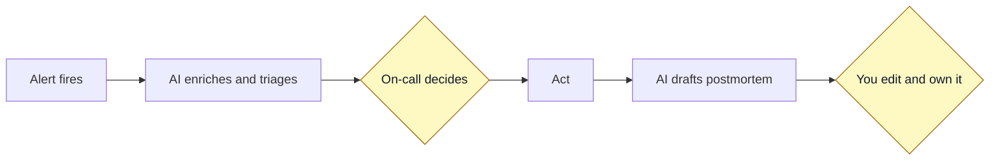

# Topic 4: Alerts and incidents

Incidents are stressful and time-sensitive. This is exactly where a good assistant helps, and exactly where you must keep a human in charge. AI does the gathering and drafting. The on-call person decides and acts.

Trust level: Gate.

## Before an incident: better alerts

AI can help you tune alerts so there are fewer, better ones:

- Review your alert rules and point out ones that are likely noisy or unclear.
- Draft a clear description and a runbook link for an alert that has neither.
- Suggest better thresholds based on how a metric actually behaves.

Fewer, clearer alerts mean the real ones get noticed.

## During an incident

### Understand the alert fast

When an alert fires, paste it in and ask for a plain-language explanation, a sense of urgency, and the most likely causes with the reasons behind them. See the [explain an alert prompt](../../prompts/explain-an-alert.md).

### Get organized

In the first minutes, use AI to structure the response: a one-line impact summary, a suggested severity, the top hypotheses with evidence, and an ordered list of next actions marked safe-to-check or changes-production. See the [incident triage prompt](../../prompts/incident-triage.md).

### Find the likely cause

Feed it the signals from [topic 3](../03-monitoring/README.md): the metric that fired, the logs from that window, a slow trace. Ask for the most likely cause and what to check next. Treat the answer as a lead to confirm, not a verdict.

### Keep everyone informed

Ask it to draft a short, honest status update for your team channel. Say what you know and what you are still checking. Update and repeat as the incident develops.

## After an incident: the postmortem

Writing a postmortem from a blank page is hard. Give the model the timeline and let it draft the document, then you edit and own it. See the [postmortem prompt](../../prompts/draft-a-postmortem.md).

Keep it blameless. The draft should focus on systems and process, not people. You make sure the final version does too.

## Where the human stays in control

- The AI suggests causes and actions. The on-call person chooses.
- Anything that changes production goes through your normal review, even during an incident.
- The AI never runs commands on its own here. Its job is to help you think and communicate faster.

## Tools to look at

- [HolmesGPT](https://github.com/robusta-dev/holmesgpt) helps investigate alerts and incidents.
- [k8sgpt](https://github.com/k8sgpt-ai/k8sgpt) explains what is wrong in a Kubernetes cluster. See the [quickstart](../../examples/k8sgpt-quickstart.md).
- [Keep](https://github.com/keephq/keep) is open-source alert management with some AI features.
- [n8n](https://github.com/n8n-io/n8n) lets you build an incident workflow, for example alert to AI enrichment to Slack, with a human-approval step before any action. This is a clean way to keep the Gate level.

See the full [tools catalog](../../tools/README.md).

## Next

Go to [topic 5: CI/CD and GitOps](../05-cicd-and-gitops/README.md), or back to [all topics](../README.md).
