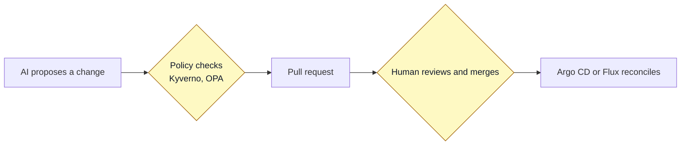

# Topic 5: CI/CD and GitOps

This is the sweet spot for AI that changes things, because a pull request is a natural place to keep a human in the loop. The AI can propose a change, checks can run on it, and a person merges it. Nothing reaches production without passing through that gate.

Trust level: Gate.

## AI inside pull requests

- Add an AI review step that posts a plain-language summary of the change and its risks. It comments only. It does not approve or merge. See the [example workflow](../../examples/ai-pr-review-github-action.md) and the [PR review prompt](../../prompts/review-a-pull-request.md).
- Ask AI to suggest tests and test data for new code.
- Use AI to explain a large diff quickly before a human reads it closely.

Keep the human review. The AI gives a first pass, not the final word.

## Turning security noise into a short list

Scanners like Trivy and Grype produce long lists of findings. AI can turn that into something you can act on:

- Rank findings by real risk, not just severity score.
- Explain what each finding means for your setup.
- Group related findings so you fix a root cause once.

You still decide what to fix and when.

## The key pattern: fix through Git, not through access

This is the heart of safe AI in ops. Instead of giving an agent access to run commands on your cluster or cloud, you give it one ability: open a pull request to your GitOps repository.

The flow:

1. The AI notices a problem or is asked to make a change.
2. It writes the change to the desired-state repo and opens a pull request, with its reasoning in the description.
3. Your normal checks run on the pull request.
4. A person reviews and merges.
5. Argo CD or Flux applies the change to the cluster.

The AI never touches the cluster directly. Its only tools are Git and a pull request. If the change is wrong, it is caught in review, and there is a full history of what was proposed and why.

## Policy-gated AI

Take it one step further. Before the AI even opens the pull request, run the proposed change through your policy checks: Kyverno, OPA, or conftest. If it fails a policy, it does not become a pull request. This means the AI has to pass the same gates a human does. It cannot propose something that breaks your rules.

This pattern fits your existing tools perfectly. You already run these checks on human changes. Now they also guard AI changes.

## Where the human stays in control

- The AI's only power is to open a pull request. No direct cluster or cloud access.
- Policy checks run before and during the pull request.
- A person reviews and merges every change.
- GitOps gives you a full audit trail and easy rollback.

## Next

Go to [topic 6: build your own helpers](../06-build-your-own/README.md), or back to [all topics](../README.md).
